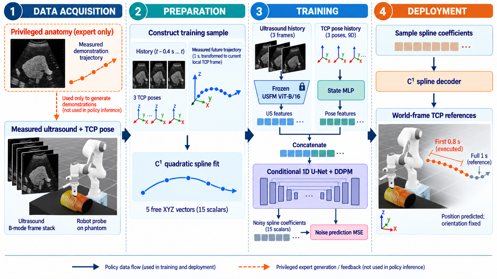

# Ultrasound Diffusion Spline Policy (US-DP)

US-DP learns measured TCP **position** trajectories from ultrasound and TCP pose history. It fits demonstrations to a locally anchored C1 quadratic spline, trains a conditional DDPM on its free XYZ coefficients, and produces timed world-frame Cartesian references. Expert anatomy is excluded from policy observations.



https://github.com/user-attachments/assets/9988ebfe-09ec-4a38-a184-9e77af8da5f0

See the [implementation guide](docs/data_flow.md) for data formats, formulas, metrics, and module details.

## Clone and set up

Clone with submodules: this repository contains `i4h-workflows` (Isaac launcher and task), `i4h-sensor-simulation`, `spline_policy`, and `USFM`.

```bash
git clone --recursive git@github.com:Hydran00/us_diffusion_policy.git us_dp
cd us_dp
```

For an existing clone, run `git submodule update --init --recursive` from its root. The `i4h-workflows` submodule uses an SSH GitHub URL, so cloning requires access to that repository.

Install the Python CLI from the **US-DP repository root**:

```bash
python3 -m venv .venv
.venv/bin/python -m pip install -e '.[hdf5]'
.venv/bin/python -m pip install --no-deps -e ./USFM
```

The nested `spline_policy` checkout is found automatically. For image-conditioned training, download a compatible USFM checkpoint and set `usfm_pretrained` in the config used for preparation; `configs/default.json` leaves it unset. Pose-only training does not require pretrained USFM weights.

Initialize the Isaac environment using [i4h-workflows/README.md](i4h-workflows/README.md#setup-from-the-command-line). For environment initialization, Docker, or simulator startup errors, follow that submodule's [troubleshooting guide](i4h-workflows/TROUBLESHOOTING.md); it owns the simulator setup. All commands below run from the US-DP repository root unless noted. Set `DISPLAY` to your working X display only when needed; `:2.0` in older examples is machine-specific.

## Collect and prepare demonstrations

```bash
i4h-workflows/run.sh ultrasound_liver_scan \
  --rule-based --episodes 200 --attempts 1 \
  --run-dir runs/ultrasound_liver_scan/acq_c \
  --record demos.hdf5 --record-failures --ultrasound
```

This visibly runs the rule-based expert for 200 episodes and records HDF5 demonstrations plus logs in `runs/ultrasound_liver_scan/acq_c/`. `--record-failures` retains failed attempts in the recording; preparation filters them out. Add `--headless` only for unattended collection. A relative `--record` path is resolved inside `--run-dir`, not the shell's current directory.

```bash
.venv/bin/us-dp prepare \
  --input runs/ultrasound_liver_scan/acq_c \
  --output data/prepared_acq_c \
  --config configs/default.json
```

`prepare` reads the run's `run.json` and HDF5 recording, keeps successful usable episodes, fits spline targets, and creates grouped train/validation/test splits. It also accepts a canonical HDF5 file or raw NPZ directory as `--input` (`--raw` is an alias). The effective config is saved in `data/prepared_acq_c/manifest.json`. Set `usfm_pretrained` in the config before preparing if the image-conditioned training below will use it.

## Train and inspect

```bash
.venv/bin/us-dp train \
  --dataset data/prepared_acq_c --output runs/train_acq_c --device cuda:0

.venv/bin/us-dp train \
  --dataset data/prepared_acq_c --output runs/train_acq_c_no_image \
  --device cuda:0 --no-image-conditioning
```

The first command trains with ultrasound and TCP history; the second trains a pose-only ablation on the **same prepared splits**. The pose-only model does not construct or run the USFM encoder, although the data pipeline still reads the stored images. Training writes `best.pt` (lowest validation noise loss), `last.pt`, and TensorBoard events under each output directory. It stops after five consecutive epochs without validation improvement by default.

```bash
.venv/bin/tensorboard --logdir runs --port 6006
```

Open `http://localhost:6006` to inspect batch/epoch losses, validation metrics, learning rate, and timing. For a remote machine, forward port 6006 over SSH.

## Offline evaluation and comparison

```bash
.venv/bin/us-dp evaluate \
  --checkpoint runs/train_acq_c/best.pt \
  --dataset data/prepared_acq_c --split test --device cuda:0

.venv/bin/us-dp compare-image-conditioning \
  --checkpoint-a runs/train_acq_c/best.pt \
  --checkpoint-b runs/train_acq_c_no_image/best.pt \
  --dataset data/prepared_acq_c --device cuda:0 \
  --output runs/image_comparison.md
```

`evaluate` scores a checkpoint on the recorded test windows, **not** a full simulator rollout. `compare-image-conditioning` scores both checkpoints on the same 1.0-second prediction windows and writes a copyable Markdown metric table. Use checkpoints trained on the same prepared dataset for a meaningful comparison.

To compare complete closed-loop episodes in Isaac as well, add `--sim-episodes N` to the comparison command. For simulator-only evaluation, use:

```bash
.venv/bin/us-dp compare-image-conditioning \
  --checkpoint-a runs/train_acq_c/best.pt \
  --checkpoint-b runs/train_acq_c_no_image/best.pt \
  --skip-offline --sim-episodes 5 --device cuda:0 \
  --output runs/simulator_comparison.md
```

This runs five visible simulator episodes **per checkpoint**, one checkpoint after the other, and reports success and TCP tracking metrics. No `--dataset` is needed with `--skip-offline`. It can take substantially longer than offline window evaluation.

## Inspect a policy rollout

```bash
i4h-workflows/run.sh ultrasound_liver_scan \
  --policy --task-id us_dp/ultrasound_liver_scan \
  --checkpoint "$PWD/runs/train_acq_c/best.pt" \
  --episodes 1 --attempts 1 --ultrasound \
  --record verify.hdf5 --record-failures
```

This opens the simulator and runs one episode with normal replanning. The recording and backend logs are in the run directory printed by the launcher. For a one-plan diagnostic, prefix the same command with `US_DP_SINGLE_PLAN=1`; the policy then executes a single 1.0-second prediction without replanning and saves its predicted trajectory as PNG and NPZ under `<run-dir>/trajectories/`.

```bash
.venv/bin/python -m us_dp.deployment.plot_trajectory \
  "<run-dir>/trajectories/episode_0000_step_000002.npz"
```

This opens a rotatable 3D plot of the **predicted** waypoints; check the exact NPZ filename in `backend-us_dp.log`. The plotted curve is not the measured robot motion.

To test an image-trained checkpoint with blank ultrasound input, prefix the rollout command with `US_DP_ZERO_IMAGES=1` (and optionally `US_DP_SINGLE_PLAN=1`). This is an inference-time ablation, **not** equivalent to the separately trained pose-only model: its image encoder remains active. The simulator images and recordings remain unmodified.

## Software-only check

```bash
.venv/bin/us-dp smoke --output /tmp/us-dp-smoke
```

`smoke` exercises synthetic collection, fitting, training, and inference without Isaac or real ultrasound data. The historical `runs/diagnostics/validate_sampling_fix.py` command in [usage.md](usage.md) is workspace-specific and is not shipped here.

## Current policy contract

With defaults, each input window contains three 128-square grayscale frames and three 9-value TCP pose states. The model samples 15 free XYZ spline scalars for a 1.0 s path (50 steps at 50 Hz). The controller normally executes 0.8 s (40 steps), then replans from the measured TCP. Desired orientation remains the first one observed after `reset()`; no orientation or joint trajectory is learned.

Raw recordings may have seven arm positions and velocities before the pose. `prepare` discards these 14 fields. Older 23D checkpoints remain loadable. See [the precise field and frame conventions](docs/data_flow.md#2-raw-episode-contract-and-hdf5-import).

The `src/us_dp` subpackages separate acquisition, anatomy, data preparation, training, and deployment. `_compat` forwards old Python import paths. `us-dp` and `python -m us_dp` enter the same CLI.
